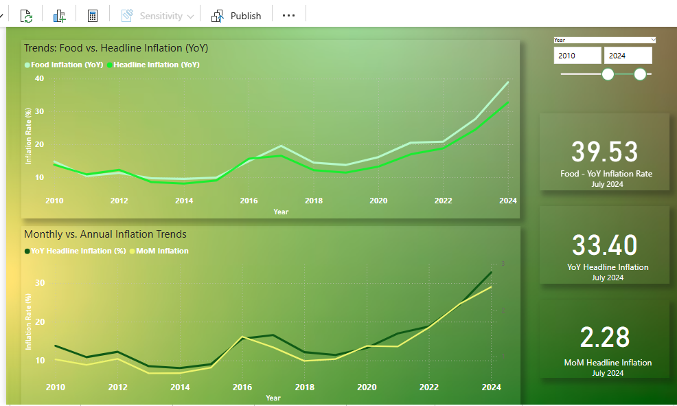
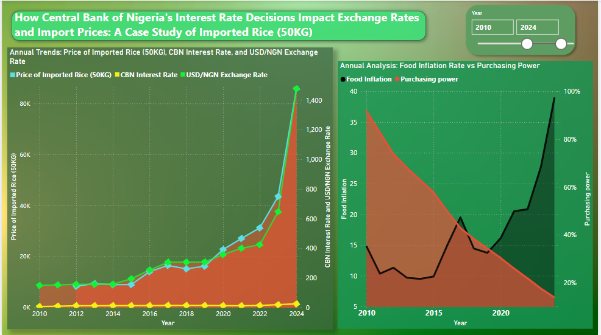
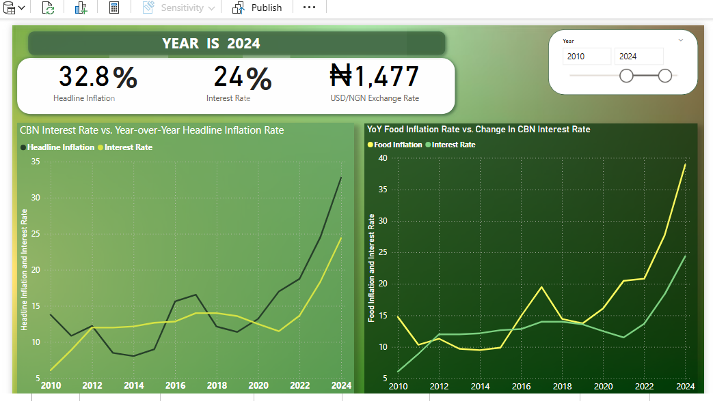
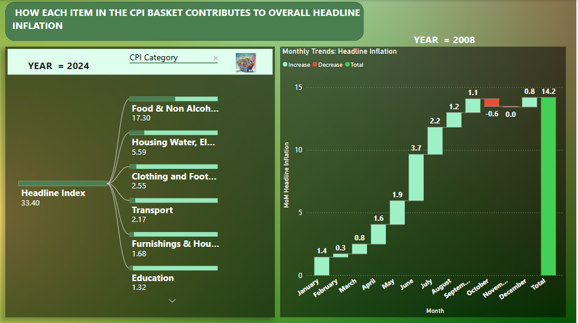

# Inflation-Analysis
Analyzing the impacts of inflation on the Nigerian economy: A data-driven approach  

 # Insights and Recommendations

 # Introduction
 
One key macroeconomic indicator that has far-reaching ripple effects and affects the everyday life of Nigerians is inflation. Over the past decade, Nigeria has experienced an exponential rise in inflation, pushing more than half of its population below the poverty line. This report examines the causes of inflation and its impact on people and the economy. Using historical data, I analyzed inflation’s relationship with key indicators such as monetary policy, exchange rates, unemployment rates, and the prices of goods. Leveraging Power BI’s powerful visualizations, I explored trends and components of these variables. The goal of this analysis is to identify different types of inflation, highlight inflationary trends over the past decade, and examine how different economic factors contribute to fluctuations in inflation.

 ***NB: Before you dive into the analysis piece by piece, please take a moment to read this refresher on CPI. This aims to provide essential context, especially for those without an economics background***

_**The Consumer Price Index**: All Items (Headline Index) is a price index of a basket of goods and services paid by consumers. Percent changes in the price index measure the inflation rate between any two time periods_

_The CPIs are based on prices for food, clothing, shelter, and fuels, transportation fares, health, education, communication etc. The index measures price changes (as a percentage change) from a predetermined reference date. It measures the average change in prices of goods and services consumed by people over time. It is commonly used to track inflation and understand how the cost of living changes. A rising CPI means that prices are increasing, reducing the purchasing power of money._

# Food Inflation vs Headline Inflation:
# 

On a year-on-year basis in 2010, Food inflation rate stood at 14.77% relative to Headline inflation rate of the same year at 13.88%. Looking at the movement, food inflation showed a slight increase of 0.89% compared to the headline inflation. Meanwhile, in 2024, Food and Headline Inflation jumped to a significant leap of 39.53% and 33.40% respectively. The rise represents an unprecedented level of inflation in both categories, showing an all-time high rate recorded in the history of the country.

# Monthly and Annual Inflation Trends: 
# 
Headline Inflation rate on a Month-on-Month and Year-on-Year basis move together rapidly, indicating a steeper upward trend on the graph. On both occasions, inflation surged more than twice their previous levels in the span of ten years (2010 - 2024).

# Headline Inflation Rate and Purchasing Power: 
# .png)

A strong negative correlation exists between inflation and purchasing power. Using November 2009’s CPI of 100 as the base period for comparison, our analysis reveals a steep decline in the purchasing power of Naira. As inflation rate soars, purchasing power falls drastically. In reference to November 2009, with a CPI of 100, the purchasing power of Naira declined to just 14% by 2024. This implies that an item that cost N100 in 2009 would now cost approximately N714 in 2024, meaning the same amount of money buys significantly less today. This indicates that inflation has significantly eroded the value of our money.

# Exchange Rate and Headline Inflation Rate: 
# 

The USD to NGN exchange rate surged to an alarming average of ₦1,477 in 2024, up from ₦148.8 in 2010.  As Naira depreciates sharply against the strong Dollar, inflation rate skyrocketed, growing over twofold. Our analysis reveals a sharp deterioration in the Naira’s value, indicating a positive correlation between inflation and exchange rates. Notably, in November 2009 (our base period), the CPI was 100, whereas by 2024, inflation had risen by 32.8%, bringing the average CPI to 696. Over ten years, the price level became more than six times higher than in 2009.

# CBN Monetary Policy Rate and Inflation Rate:
#  

The MPR is the official interest rate of the CBN, which anchors all other interest rates in the money market and the economy. When the CBN adjusts interest rates, it influences the exchange rate, which in turn indirectly impacts the general price level of goods and services. On a year-on-year basis, Inflation rate tends to increase or decrease gradually following shifts in interest rates. From 2018 to 2019, interest rate fell by 2.9% where a drop of 5.7% was recorded for inflation between both years. Interest rate made a big leap in 2024, reaching an all-time high of 24.39%. As a result, inflation followed sharply, climbing to 32.8%.

# Contribution of Consumer Price Index (CPI) Items to Headline Index(inflation):
#   

The contributions of items in the CPI Basket to the increase in the headline index in July 2024 are presented below: 
                                                      
Food & Non Alcoholic Bev.	  =                                 17.3,
Housing Water, Electricity. Gas and Other Fuel	  =            5.59,
Clothing and Footwear	  =                                     2.55,
Transport	        =                                           2.17,
Furnishings & Household Equipment Maintenance	 =              1.68,
Education	                                   =                1.32,
Health                                       =                1,
Miscellaneous Goods & Services	               =               0.56,
Restaurant & Hotels	                          =               0.4,
Alcoholic Beverage. Tobacco and Kola	          =              0.36,
Recreation & Culture  	                         =             0.23,
Communication	                                  =             0.23

**At 17.3%, Food (& Non Alcoholic Bev.) inflation** is the biggest contributor to All item index, also known as headline inflation. The rise in headline inflation on a year-on-year basis was largely caused by increases in the prices of food items.

# Recommendations

To help steer the Nigerian economy in the right direction, the following outlines recommendations based on my analysis of inflation trends in the country:

**•	Controlling Food Inflation Through Agricultural Reforms:**
Increase investment in local food production to reduce dependency on imported food, which significantly contributes to inflation. However, in the short term, importing affordable food items from neighboring countries should be considered as a temporary measure to stabilize prices while gradually building the capacity for self-sufficiency in food production.

**•	Strengthening Monetary Policies to Stabilize Inflation:**
The Central Bank of Nigeria (CBN) should set interest rates at a level that helps keep inflation in check without slowing down economic growth. Adopting a balanced approach would ensure inflation is controlled while still allowing businesses and individuals to access credit for productive activities that drive economic growth.

**•	Increase The Minimum Wage Which Will Help Improve Purchasing Power:**
With wages staying the same while inflation rises, the real value of income declines, making it harder for people to afford goods and services. To keep up with rising inflation, government and policymakers should introduce measures that adjust wages to ensure people's purchasing power remains stable.

**•	Reducing Government Spending:**
Nigeria recorded a budget deficit over N15 trillion which implies we’re not earning enough to support our spending. The government should cut unnecessary spending to help control inflation. Reducing wasteful expenses and finding ways to increase revenue can help reduce inflation and support the economy. 

